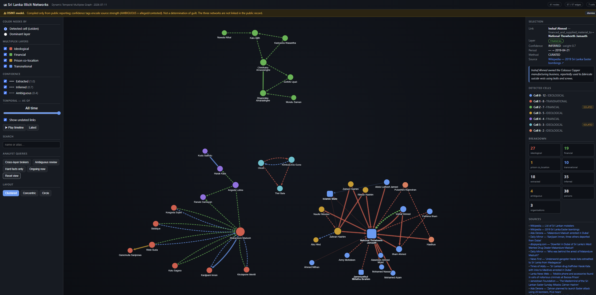

# Aegis

[](https://github.com/drex7001/Aegis/actions/workflows/ci.yml)

**Aegis is an ontology-driven, governed intelligence platform.** A single
declared ontology — object types, properties, links, events, actions, and
governance rules ([`ontology/aegis.yaml`](ontology/aegis.yaml)) — powers every
analytical domain built on the platform. **Criminal-network analysis over a
Sri Lankan OSINT corpus is the first application domain, not the platform's
identity** (ADR-023). Comparable in concept to Palantir's ontology-centred
systems, but open-stack, independently auditable, and built for Sri Lanka's
legal and trilingual (Sinhala / Tamil / English) context.

The core principle:

> **Entities are not facts. Relationships are not facts. Intelligence consists
> of claims supported, contradicted, or contextualized by evidence and
> sources.**

| | |
|---|---|
| Vision (north star) | [`GOAL.md`](GOAL.md) |
| Constitution | [`speckit/constitution.md`](speckit/constitution.md) — 14 non-negotiable articles |
| Build path | [`speckit/`](speckit/README.md) — roadmap v2 (P0–P9), phase charters, ADRs, detailed specs |
| Domain artifact | [`ontology/aegis.yaml`](ontology/aegis.yaml) — the single source of domain truth (Article XI) |
| Contributing | [`docs/GIT_WORKFLOW.md`](docs/GIT_WORKFLOW.md) — GitHub Flow: branch → PR → green CI → squash |

## What exists today

**Milestone I (Phases 0–1) is complete** — the governed foundation:

- **Claim store** (PostgreSQL + PostGIS): every relationship and attribute is a
  claim with source, grading, time window, and handling code — never a bare fact.
- **Evidence vault** (MinIO): content-addressed originals, hash ledger,
  derivative tracking (Article IV).
- **AuthN/AuthZ**: Keycloak OIDC + OpenFGA ReBAC + handling-code row filters;
  every API route carries an authorization dependency (Article VI).
- **Audit**: append-only, hash-chained event log with chain verification
  (Article X).
- **Governed extraction**: the LLM/structural extraction passes emit *suggested
  claims* into a review queue — humans adjudicate; nothing algorithmic writes
  to canon (Article VII).
- **Projections**: rebuildable caches (Article XIII) that currently also feed
  the legacy explorer UI.
- **API v1 + `aegis` CLI**, migrations, backup/restore runbook.

**Active phase: Phase 2 — the ★ MVP gate** (identity resolution, provenance
panels, review-queue UI, basic search; see
[`speckit/tasks-phase-2.md`](speckit/tasks-phase-2.md)). The full roadmap to
production is [`speckit/roadmap.md`](speckit/roadmap.md).

## Quickstart

Prerequisites: Docker + Compose v2, Python 3.12, [`uv`](https://docs.astral.sh/uv/)
(optional — plain `pip` works).

```bash
make up && make bootstrap        # compose stack: postgres+postgis, minio, keycloak, openfga
python3.12 -m venv .venv && make install   # aegis package + dev deps (uv; or .venv/bin/pip install -e ".[dev]")
.venv/bin/aegis db upgrade       # alembic migrations
.venv/bin/aegis migrate-legacy   # one-time: import the curated OSINT corpus as claims
.venv/bin/aegis projections rebuild
.venv/bin/aegis serve            # API (+ legacy explorer) at http://127.0.0.1:8000 — /docs for OpenAPI
```

Verify the build the way CI does:

```bash
make test              # pytest (integration tests need the compose test DB)
make lint-ontology     # aegis ontology validate — the Article XI gate
```

## Repository map

| Path | What |
|---|---|
| `aegis/` | Platform core package: ontology loader/codegen, actions, queries, authz, audit, API, projections, one-time migration adapters |
| `ontology/aegis.yaml` | The versioned domain artifact everything derives from (Article XI) |
| `speckit/` | Constitution, spec, plan, decisions (ADRs), roadmap, phase charters, detailed specs |
| `infra/` | Compose stack + bootstrap (PostgreSQL/PostGIS, MinIO, Keycloak, OpenFGA) |
| `tests/` | Unit + integration suites (CI runs both) |
| `docs/` | Runbooks: git workflow, backup/restore, ingestion toolchain |
| `real_data/` | Real OSINT corpus (public reporting only) + provenance/ethics rules — **read [`real_data/README.md`](real_data/README.md) first** |
| `sample_data/` | Fictional test data |
| `Files/` | Raw drop zone for ingestion (PDF / video / audio / text) |
| `pipeline/`, `app/`, `build_real_graph.py`, `demo.py`, `cypher/`, `output/` | **Legacy prototype** — see below |

## Data & ethics

Two strictly separated tracks: `sample_data/` is **fictional**; `real_data/` is
compiled **only from public reporting** about documented cases, every claim
cited. The platform never stores national-ID numbers for real persons, never
renders association as guilt (Article IX), and never lets AI output become fact
without human adjudication (Article VII). Rules and source list:
[`real_data/README.md`](real_data/README.md).

## Legacy prototype

Aegis grew out of a prototype — *"Sri Lanka Illicit Networks — Temporal
Multiplex Graph"*: a regex + LLM extraction pipeline and a Cytoscape.js
explorer over a static graph JSON. Per **ADR-023 it is replaced, never
extended**: it now runs only as scaffolding (the explorer is served by
`aegis serve` from a rebuildable projection) until the Phase 4 workspace
deletes it. Its documentation is kept for reference:
[`ARCHITECTURE.md`](ARCHITECTURE.md) (component tour) ·
[`docs/RUNNING.md`](docs/RUNNING.md) (commands) ·
[`docs/ADDING_DATA.md`](docs/ADDING_DATA.md) (data recipes) ·
[`docs/INGESTION.md`](docs/INGESTION.md) (raw-file ingestion — this toolchain
remains the front end of the governed landing zone).


